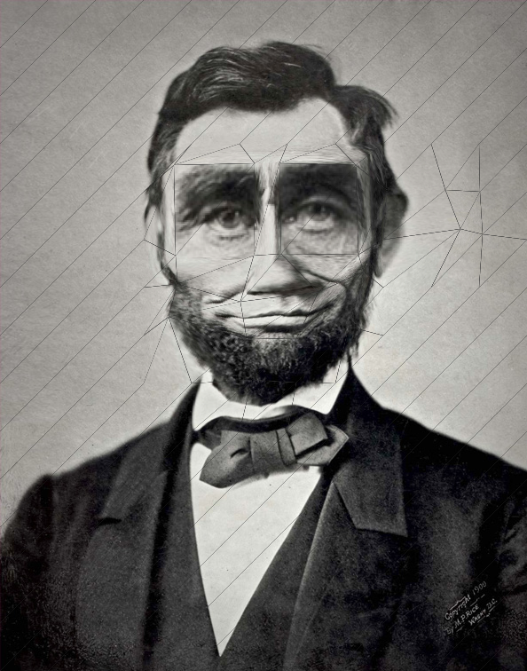

image distortion experiment
===

this is an experiment for the web browser. it lets you distort an image by moving intersections in a grid.

[](http://snorpey.github.io/distort-grid/)

[online demo](http://snorpey.github.io/distort-grid/)

some parts of the warping code are taken from [@migurski](https://github.com/migurski)s [canvas warp demo](https://github.com/migurski/canvas-warp/blob/master/index.html).

build script
---
the build script takes care of concatenating and minifying all scripts and styles. it uses [gruntjs](http://gruntjs.com/).

please make sure that [nodejs](http://nodejs.org/) is installed on your machine.

run ```npm install``` from within the root folder of the project to install the dependencies of the build script.

to build the project, run ```npm build```. the optimized files will get copied to the ```dist/${BUILD_DATE}``` folder.

third party code used in this experiment
---
* [js signals](http://millermedeiros.github.io/js-signals/) by [millermedeiros](https://github.com/millermedeiros), MIT license
* [require js](http://requirejs.org/), by [jrburke](jrburke), BSD & MIT license
* [almond js](https://github.com/jrburke/almond), by [jrburke](jrburke), BSD & MIT license
* [raf js](https://gist.github.com/paulirish/1579671), by [paulirish](https://github.com/paulirish), MIT license
* [reqwest js](https://github.com/ded/reqwest/), by [ded](https://github.com/ded), MIT license

license
---
[MIT License](http://www.opensource.org/licenses/mit-license.php)
